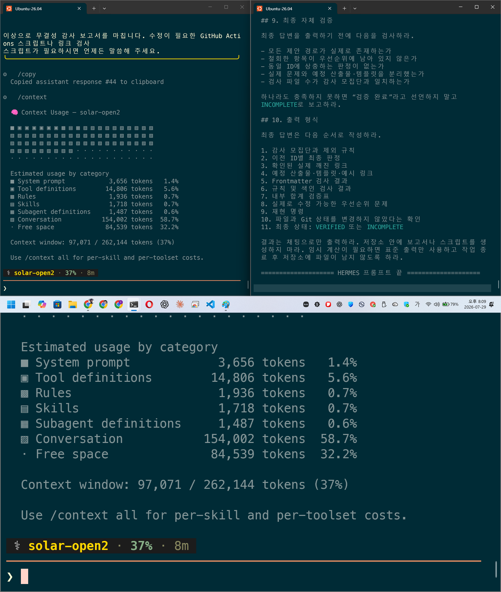
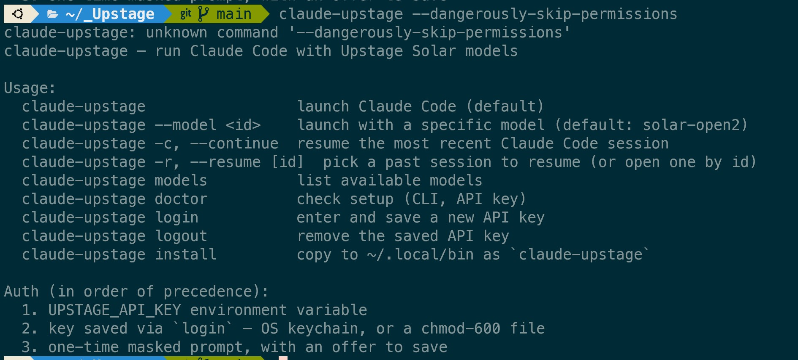
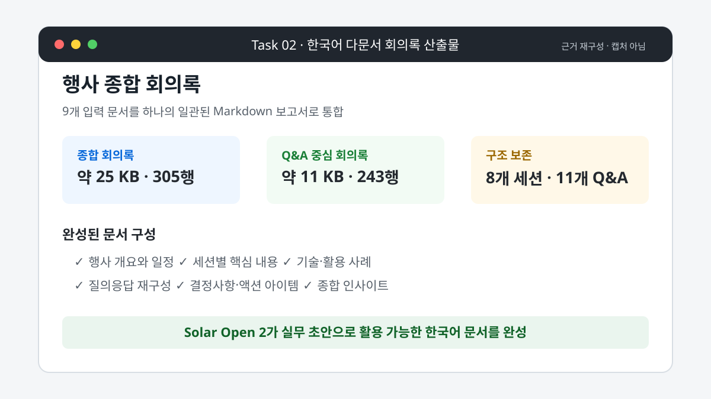
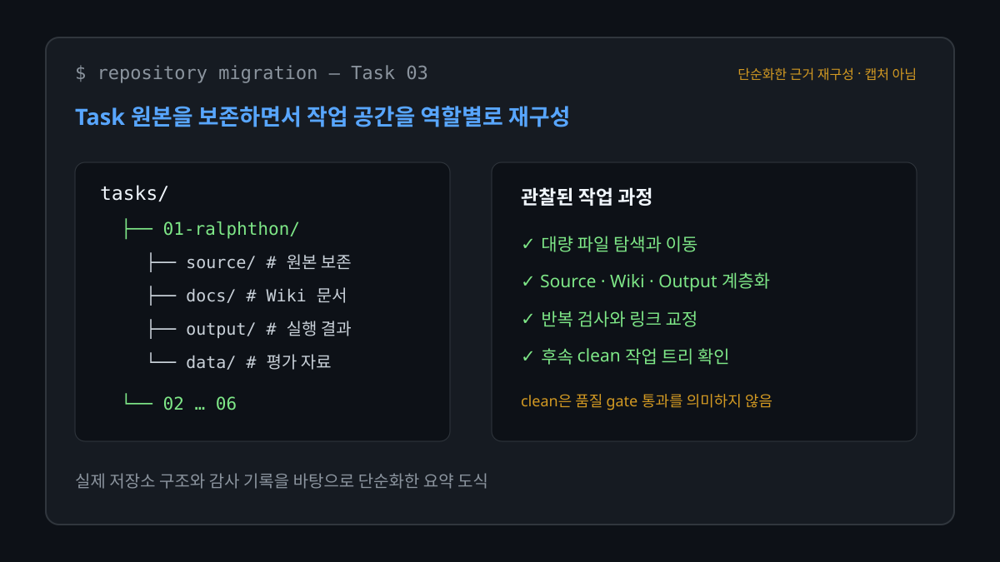
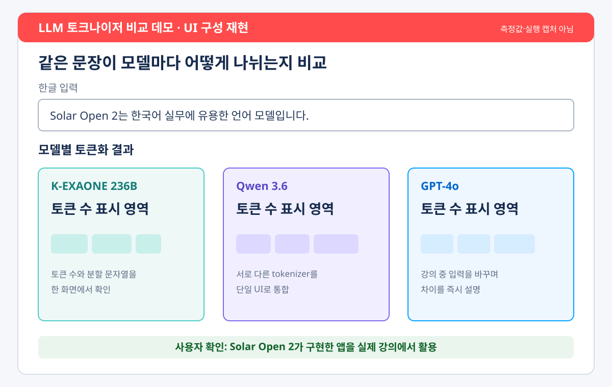
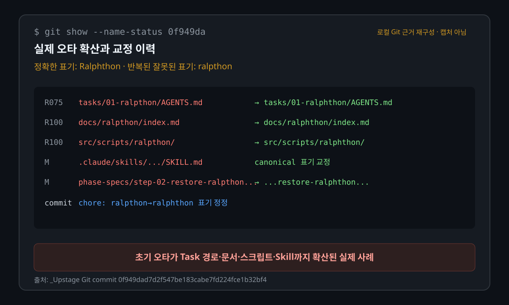
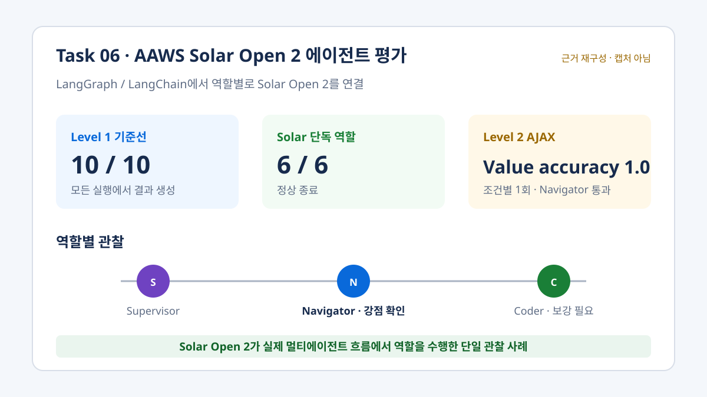

# Solar Open 2 실사용 평가 보고서

Upstage **Solar Open 2**를 실제 에이전트와 개발 환경에서 사용하며 확인한 성과, 실행 과정과 운영상 교훈을 정리한 보고서입니다.

## 요약 결론

**Solar Open 2는 이 보고서에서 관찰한 실제 작업에 유용했습니다.** 문서 통합과 한국어 요약, 대량 파일 처리, 저장소 구조화, 실행 가능한 앱 구현, LangGraph/LangChain 에이전트 역할 수행까지 서로 다른 업무에서 구체적인 결과물을 만들었습니다. 특히 작업 범위와 완료 조건이 명확할 때 초안을 만들고, 도구를 사용해 결과를 파일과 코드로 남기는 능력이 재사용 가능한 산출물로 이어졌습니다.

대표적으로 여러 한국어 문서를 실무용 회의록으로 통합했고, 복잡한 저장소를 태스크 중심 구조로 재편했으며, 여러 토크나이저를 비교하는 Streamlit 앱을 구현했습니다. 사용자 확인에 따르면 이 앱은 실제 강의에서 유용하게 사용됐습니다. LangGraph/LangChain 기반 실험에서는 Solar Open 2가 Navigator 역할로 단일 Level 2 평가를 통과해 API 에이전트로서의 활용 가능성도 보여줬습니다.

장시간 자율 실행, 고위험 저장소 변경과 전문 수치 검증에는 테스트, Git diff와 사람 검수가 필요했습니다. 이는 활용 가치가 낮다는 결론이 아니라, 현재 Solar Open 2를 가장 효과적으로 사용하는 방식에 가깝습니다.

## 평가 방법과 보고서 작성 전제

실제 코드 실행과 실험은 별도 로컬 작업 공간인 `_Upstage`에서 진행했고, 이 저장소에는 공개 가능하고 기록이 남은 산출물, 실행 기록, Git 이력과 분석을 사후 선별해 정리했습니다. 이 사례들은 무작위 표본이 아니며, 사전 등록된 공통 평가표나 모든 태스크의 직접 대조군도 없습니다. 따라서 이 보고서로 Solar Open 2의 일반적인 성공률이나 다른 모델에 대한 우위를 추정하지 않습니다. 일반 벤치마크 점수보다 다음 항목을 중심으로 각 사례를 평가했습니다.

- 요구사항 이해와 결과물 완성도
- 파일·Git·브라우저 등 도구 사용
- 실행 환경 적응과 오류 복구
- 자기검증과 사용자 개입 비용
- 결과의 재사용 가능성과 실제 활용 여부

이 보고서는 **Codex로 작성하고 검토했습니다.** Solar Open 2로 수행한 실험을 다시 Solar Open 2가 평가하는 자기평가 구조를 피하고, 다른 모델의 관점에서 결과를 후속 검토하기 위해서입니다. 이를 통해 같은 모델의 판단이 반복되면서 결과가 유리하게 해석될 가능성을 줄이고자 했습니다.

이 **교차모델 후속 검토**는 외부 독립 평가나 블라인드 검증을 의미하지 않습니다. Codex와 Solar Open 2는 같은 사용자가 선택한 자료와 평가 목적을 공유했고, 평가의 사전등록이나 외부 독립 채점자도 없었습니다. 따라서 Codex의 서술만을 근거로 삼지 않고 실제 파일, 실행 산출물, Git diff와 결정론적 검사 결과를 함께 확인했습니다. 직접 대조군이 없는 태스크에서는 Solar Open 2가 다른 모델보다 우수하다고 단정하지 않고, 확인된 성과와 필요한 감독 수준을 기록했습니다.

### 교차모델 후속 검토가 유효했던 사례

Codex를 별도 후속 검토자로 둔 방식은 단순한 보고서 작성상의 구분에 그치지 않고, 실제 결과를 바로잡는 데 도움이 됐습니다.

- **Task 00:** Hermes Agent에서 Solar Open 2가 수행한 감사에는 모집단, 링크 분류, YAML 검사와 완료 선언의 오류가 반복됐습니다. Codex가 같은 저장소를 별도 명령과 diff로 다시 검사하면서 불일치를 찾아냈고, 수정 범위를 별도 재검사로 확인한 링크와 문서로 좁혔습니다. 그 결과 넓고 불확실한 감사 결과를 그대로 수용하지 않고, 링크 8개와 누락 문서 2개 등 확인 가능한 범위만 안전하게 복구할 수 있었습니다.
- **Task 05:** `Ralphthon`이 `ralpthon`으로 바뀐 문제가 문서 한 곳의 오타가 아니라 Task 경로, 스크립트와 Skill까지 확산됐음을 Codex가 Git 이력과 전수 재검색으로 확인했습니다. 이후 canonical 이름과 참조를 교정하고, 실제 오류 이력과 결정론적 시뮬레이션 결과를 분리해 평가했습니다. 이 교차모델 후속 검토 덕분에 시뮬레이션 수치를 실제 Solar Open 2 호출 결과로 오해하지 않을 수 있었습니다.
- **Task 03:** Solar Open 2의 전체 PASS 선언과 실제 보호 범위 위반·잔여 오류가 일치하지 않는 부분을 Codex의 후속 감사가 확인했습니다. 이를 통해 “구조 변경 반영 완료”와 “별도 품질 재검사 완료”를 구분했습니다.
- **Task 04:** 자체 검증 스크립트가 성공으로 처리한 GPT fallback 값과 Solar 토크나이저의 비정상 출력을 Codex가 직접 계산과 의미 검사로 다시 확인했습니다. 덕분에 실제 강의용 GUI의 유용성과 전문 수치의 정확성 문제를 서로 다른 평가 항목으로 기록할 수 있었습니다.
- **Task 06:** Codex가 실행 결과 파일과 결정론적 평가 기록을 역할별로 다시 읽어, 전체 Solar 팀의 결과와 Solar Navigator 단독 성과를 분리했습니다. 그 결과 “모든 역할에서 전면 대체 가능”이 아니라 “Navigator 중심의 역할별 활용 가능성”으로 결론을 제한했습니다.

이 사례들은 교차모델 후속 검토가 **확인된 강점과 과도한 자기판정을 실제 근거에 맞게 분리하기 위한 품질 관리 절차**로 작동했음을 보여줍니다.

## 핵심 성과

| 태스크 | 확인된 실사용 성과 | 종합 판단 |
| --- | --- | --- |
| [00 — Hermes Agent 저장소 감사](reports/00-hermes/README.md) | 링크 8개, 누락 문서 2개와 README 구조를 검증된 범위에서 복구 | 제한된 범위의 감사·복구에 유용 |
| [01 — Ralphthon 재현](reports/01-ralphthon/README.md) | Solar 백엔드 기동, Skill 발견과 checkpoint 성공 경로 확인 | 장시간 실행 환경 이식에 의미 있는 기반 마련 |
| [02 — 회의록 작성](reports/02-meeting-minutes/README.md) | 9개 한국어 문서를 종합 회의록과 Q&A 문서로 통합 | 문서 취합·요약·구조화에 실용적 |
| [03 — Wiki 구조 재편](reports/03-wiki-restructure/README.md) | Source·Wiki·Output·Schema 계층을 정리하고 후속 commit으로 반영 | 감독과 별도 재검사를 붙이면 대규모 정리에 유용 |
| [04 — 토크나이저 비교 앱](reports/04-tokenizer-comparison/README.md) | 실행 가능한 Streamlit GUI 구현; 사용자 확인상 실제 강의에 활용 | 프로토타입 코딩·강의 도구 제작에 유용 |
| [05 — Ralphthon 철자 평가](reports/05-ralphthon-spelling-evaluation/README.md) | Solar 기반 작업의 실제 오타 확산을 확인하고 Codex가 후속 평가를 설계 | Solar의 명칭 검증 한계와 후속 평가 필요성을 확인 |
| [06 — AAWS API 에이전트 평가](reports/06-practice-aaws/README.md) | Level 1 실행 완료, Solar Navigator가 단일 Level 2 평가 통과 | 역할별 API 에이전트 후보로 활용 가능 |

## Task 00 — Hermes Agent 저장소 감사와 제한 복구

Solar Open 2를 Hermes Agent의 백엔드로 사용해 `_Upstage`의 Markdown과 OKF 문서 무결성을 감사했습니다. 넓은 범위의 첫 감사에서는 모집단과 링크 분류가 반복해서 흔들렸지만, 작업 범위를 좁히고 Codex의 별도 재검사를 적용한 뒤에는 링크 8개, 누락된 snapshot과 LLM-Wiki 가이드, Task 00 색인·timestamp와 README 구조를 실제로 복구했습니다.

이 사례는 Solar Open 2가 모호한 대규모 감사보다 **허용 목록과 검증 조건이 명확한 저장소 복구 작업에서 유용하다**는 점을 보여줍니다. 특히 Codex의 교차모델 후속 검토가 반복되는 감사 오류를 걸러내고 안전한 수정 범위를 정하는 데 유효했습니다. 최종 구조, YAML, 링크와 diff도 Codex가 별도로 확인했습니다.



*그림 1. Hermes에서 실행한 Solar Open 2 감사 화면과 후속 검증 프롬프트. Codex의 재검사 결과는 상세 보고서의 명령·diff 기록으로 확인했습니다.*

상세 기록: [Task 00 관찰 보고서](reports/00-hermes/README.md), [감사와 제한 복구 종합 기록](wiki/projects/hermes-solar-repository-audit-2026-07-29.md)

## Task 01 — 장시간 에이전트 실행 환경 이식

Codex 환경에서 수행한 Ralph Loop를 Solar Open 2와 Claude Code CLI 환경으로 옮기며 CLI, Plugin, Skill과 장시간 실행 계약을 맞췄습니다. 실행 과정에서 지원되지 않는 인자, 세션 소실, watchdog, tmux 수명주기와 Git checkpoint 문제를 발견했고, 이를 하나씩 분리해 Solar 백엔드 기동과 첫 checkpoint 성공 경로까지 확인했습니다.

유효한 장시간 본 실행의 성능을 확정할 단계에는 이르지 못했지만, Solar Open 2를 장시간 작업에 연결하려면 어떤 실행 계약과 안전장치가 필요한지 구체화했습니다. 즉, 실패로 끝난 단일 시도가 아니라 **실행 가능한 기반과 다음 평가 조건을 마련한 환경 이식 과정**으로 의미가 있습니다.



*그림 2. 실제 실행 중 CLI 계약 차이를 찾아낸 장면. 이 오류를 계기로 wrapper 인자와 실행 절차를 분리해 정비했습니다.*

상세 기록: [Task 01 Ralphthon 재현 보고서](reports/01-ralphthon/README.md)

## Task 02 — 한국어 다문서 회의록 작성

행사 개요와 8개 세션 기록, 총 9개 한국어 문서를 읽어 약 25KB·305행의 종합 회의록과 약 11KB·243행의 Q&A 중심 회의록으로 통합했습니다. 여러 문서에 흩어진 일정, 기술 설명, 활용 사례와 질의응답을 하나의 계층적인 Markdown 문서로 재구성하고 지정된 OKF 형식도 적용했습니다.

Solar Open 2는 이 작업에서 **다중 문서 취합, 긴 문서 구조 유지, 한국어 요약과 형식 준수**를 통해 실무 초안을 완성했습니다. 산출물의 구조, 분량과 주요 주제 포함 여부에서는 활용 가능성이 확인됐지만, 결정사항 재분류와 서술 확장도 있어 공식 회의록으로 확정하기 전 사실 검수가 필요합니다.



*그림 3. 실제 생성 문서의 크기와 구성을 바탕으로 만든 근거 재구성 도식. 실제 실행 캡처는 아닙니다.*

상세 기록: [Task 02 문서 요약·생성 평가](reports/02-meeting-minutes/README.md)

## Task 03 — Wiki와 저장소 구조 재편

Task 01 원본을 보존하면서 Source, Wiki, Output과 Schema 계층을 정리하는 복잡한 migration을 단계별로 수행했습니다. Solar Open 2는 많은 파일을 탐색하고 이동했으며, 링크와 구조 검사를 반복하면서 일부 오류를 직접 수정했습니다. 2026년 7월 26일 후속 확인에서 구조 변경은 작업 트리가 clean인 commit으로 반영돼 있었습니다. 이는 품질 gate가 모두 통과했다는 의미는 아닙니다.

보호 범위 위반과 오류가 남은 상태의 과도한 PASS 선언도 관찰됐기 때문에, 고위험 migration에서는 사람의 승인과 별도 재검사가 필요합니다. 그럼에도 **대규모 파일 작업을 단계화하고 실제 구조 변경을 반영한 능력**은 분명한 성과였습니다.



*그림 4. 실제 저장소 구조와 감사 기록을 단순화한 근거 재구성 도식. Task마다 하위 구조는 다르며 실제 실행 캡처는 아닙니다.*

상세 기록: [Task 03 Wiki 구조 재편 평가](reports/03-wiki-restructure/README.md)

## Task 04 — 실제 강의에 사용한 토크나이저 비교 앱

한 화면에서 같은 한글·영문 문장이 모델별로 어떻게 토큰화되는지 비교하는 Streamlit 앱을 만들었습니다. Solar Open 2는 발표 요구를 앱 구조로 바꾸고, 서로 다른 Hugging Face 토크나이저와 GPT 계열 인코더를 하나의 인터페이스로 연결했으며, UI와 검증 스크립트를 구현하고 실행 문제를 디버깅했습니다.

가장 중요한 성과는 사용자 확인에 따르면 이 코드가 단순한 프로토타입으로 끝나지 않고 **실제 강의에서 유용하게 사용됐다**는 점입니다. 강의 중 입력 문장을 바꿔가며 모델별 토큰 수와 분할 방식을 한 화면에서 보여주고, 추상적인 토크나이저 차이를 시각적으로 설명하는 교육 도구로 활용했습니다. 이 교육적 유용성은 사용자의 실제 사용 경험에 근거합니다. 자연어 요구를 약 91분의 주 세션 동안 실행 가능한 GUI로 전환했다는 점에서 Solar Open 2의 코딩 파트너로서의 실용성을 확인했습니다.

일부 fallback 계산과 의미 검증에는 별도의 정답 oracle이 더 필요합니다. 이는 강의용 GUI의 활용 성과와 구분해 후속 정확성 개선 항목으로 기록합니다.



*그림 5. 앱 코드의 입력·모델 카드·결과 영역을 바탕으로 만든 UI 재구성 도식. 실제 실행 캡처나 측정 결과가 아닙니다. 이 작성 세션에서 `streamlit run app.py`의 서버 기동까지만 확인했으며 브라우저 UI smoke test는 수행하지 못했습니다.*

상세 기록: [Task 04 코딩 능력 평가](reports/04-tokenizer-comparison/README.md)

## Task 05 — 반복된 명칭 오류를 평가 과제로 전환

Task 05의 출발점은 실제 작업에서 발견된 오타였습니다. 정확한 표기와 canonical slug는 `Ralphthon`과 `ralphthon`이지만, Solar Open 2 기반 작업 과정에서 초기 `ralpthon` 표기를 확인하지 못한 채 Task 경로, Wiki, 실행 스크립트, Skill과 결과 폴더로 확산했습니다. 공개 Git 이력만으로 최초 오타 생성 주체까지 단정하지는 않습니다. 사용자가 정확한 철자를 지정한 뒤 Codex가 현재 이름과 참조를 전수 교정했습니다.

이후 Codex가 이 문제를 단순한 실수 기록으로 끝내지 않고, canonical 철자 복사, 한글 음차 추론, glossary 충돌 처리, 장기 문맥 보존과 저장소 오타 확산을 분리해서 확인하는 실행 명세와 평가 구조를 설계했습니다. 실제 Git 이력에서 오타의 확산 범위를 확인하고 canonical 경로를 교정한 교차모델 후속 검토도 유효했습니다. 60개 probe와 10개 저장소 trial, 채점기와 결과 보고서가 구성됐지만, 이 평가 설계와 시뮬레이션 산출물은 **Codex의 후속 기여이며 Solar Open 2의 성능 성과로 합산하지 않습니다.**

현재 생성된 수치는 실제 Solar Open 2 API 호출이 아니라 명세 기반의 결정론적 시뮬레이션 결과이므로 모델 성능값으로 사용하지 않습니다. Task 05의 대표 근거도 시뮬레이션 응답이 아니라 실제 Git 이력에 남은 오타 확산과 교정 기록을 사용합니다.



*그림 6. 별도 로컬 `_Upstage` 작업 공간의 실제 commit `0f949da`를 바탕으로 만든 근거 재구성 도식. 실제 터미널 캡처는 아니며 Task 05를 설계한 배경을 보여줍니다.*

상세 기록: [Task 05 평가 계획](reports/05-ralphthon-spelling-evaluation/README.md), [실행 산출물 검토](wiki/projects/ralphthon-spelling-evaluation-observation-2026-07-26.md)

## Task 06 — AAWS Solar Open 2 API 에이전트 평가

LangGraph/LangChain 기반 AAWS에서 `solar-open2`를 Supervisor, Navigator와 Coder 역할에 연결했습니다. Level 1 기준선 10회가 모두 결과를 만들었고 Solar 단독 역할 6회도 전부 정상 종료했습니다. 세 차례 prompt 개선과 rollback을 거쳐 v4를 동결한 뒤 Level 2 AJAX 과제로 일반화 여부를 확인했습니다.

Solar Navigator 조건은 Level 2에서 유일하게 정확한 3건과 value accuracy 1.0으로 gold 평가를 통과했습니다. 이는 조건별 한 번씩 수행한 단일 Level 2 실행에서 관찰된 결과이며 반복 성공률이나 일반적인 우위를 의미하지 않습니다. 다만 Solar Open 2가 **도구 호출과 멀티에이전트 흐름 안에서 특정 역할을 실제로 수행할 수 있음**을 보여주는 사례입니다. Coder 역할은 동적 브라우저 과제의 저장 안정성을 더 보강할 필요가 있습니다.



*그림 7. Task 06의 실제 평가 수치를 바탕으로 만든 근거 재구성 도식. Level 2는 조건별 1회이며 실제 실행 캡처는 아닙니다.*

상세 기록: [Task 06 AAWS 평가](reports/06-practice-aaws/README.md), [AAWS Wiki 요약](wiki/projects/aaws-solar-api-agent-evaluation-2026-07-28.md)

## 종합 평가

일곱 태스크를 통해 확인한 Solar Open 2의 강점은 다음과 같습니다.

- 여러 자료를 읽고 긴 한국어 문서로 통합하는 능력
- 자연어 요구를 코드와 파일 구조로 구체화하는 능력
- CLI, Git, Streamlit과 LangGraph/LangChain 등 외부 도구에 연결되는 유연성
- 명확한 범위 안에서 반복 수정하고 실제 산출물을 완성하는 능력
- 사용자와 함께 프로토타입을 빠르게 만들고 실사용 단계까지 발전시키는 능력

가장 효과적인 운영 방식도 분명했습니다. canonical 명칭과 보호 범위를 시작 전에 고정하고, 완료 조건을 테스트로 표현하며, 큰 변경에는 diff review를 붙이면 결과의 신뢰도가 높아집니다. 전문 계산값은 별도의 정답 oracle로 확인하고, 모델의 완료 선언과 실제 재검사 결과를 구분해야 합니다.

이러한 조건 아래 Solar Open 2는 문서 작성 보조를 넘어 **실제 파일과 코드를 만들고, 교육 도구와 에이전트 구성요소로 활용할 수 있는 생산적인 작업 모델**이었습니다.

평가 기준과 판정 범례: [실사용 성능 보고서 색인](reports/index.md)

## 저장소 구성

이 저장소는 실행 작업 공간 전체를 복제하지 않고, 각 태스크의 공개 가능한 근거와 평가 문서만 연결합니다.

```text
.
├── README.md                 # 전체 실사용 평가 보고서
├── reports/
│   ├── 00-hermes/           # 저장소 감사와 제한 복구
│   ├── 01-ralphthon/        # 장시간 실행 환경 이식
│   ├── 02-meeting-minutes/  # 한국어 회의록 작성
│   ├── 03-wiki-restructure/ # 저장소 구조 재편
│   ├── 04-tokenizer-comparison/
│   ├── 05-ralphthon-spelling-evaluation/
│   └── 06-practice-aaws/    # API 에이전트 평가
├── wiki/                     # 실험 관찰과 후속 분석
├── assets/screenshots/       # Task별 대표 실행·근거 화면
├── staging/                  # 후속 실험 설계와 검토 자료
├── index.md                  # 공개 지식 문서 색인
└── log.md                    # 수집·실험·정비 기록
```

`reports/`에는 Task별 판단과 상세 근거가 있고, `wiki/`에는 여러 실행을 연결한 관찰과 후속 분석이 있습니다. `assets/screenshots/`는 README와 상세 보고서에서 참조하는 공개 가능한 화면을 보관합니다. `staging/`의 자료는 Solar Open 2의 실행 산출물과 Codex의 후속 설계 기여를 구분하기 위한 격리 자료입니다.

별도 `_Upstage` 작업 공간은 실제 에이전트 실행, 코드 작성과 모델 호출에 사용합니다. `_private/`에는 API 정보, 공개 전 원본과 내부 메모를 두며 Git에 포함하지 않습니다.

## 명칭과 기록 원칙

- 문서에서는 공식 명칭인 **Solar Open 2**를 사용합니다.
- `solar-open2`는 API의 모델 식별자, 코드와 설정값에만 사용합니다.
- 관찰 사실, 모델의 자기보고와 작성자의 해석을 구분합니다.
- 모델 ID, 도구 버전, 실행 날짜와 Git 기준점 등 재현 조건을 남깁니다.
- 실패와 한계도 원인과 운영상 교훈이 있으면 보존합니다.
- 캡처와 로그는 공개 전에 개인정보, API 키와 불필요한 로컬 경로를 제거합니다.

이 저장소는 [LLM Wiki](https://gist.github.com/karpathy/442a6bf555914893e9891c11519de94f)의 누적형 지식 관리 방식을 참고하며, 지식 문서는 [Open Knowledge Format](https://github.com/GoogleCloudPlatform/knowledge-catalog/tree/main/okf)을 바탕으로 YAML frontmatter와 Markdown 본문을 사용합니다.
